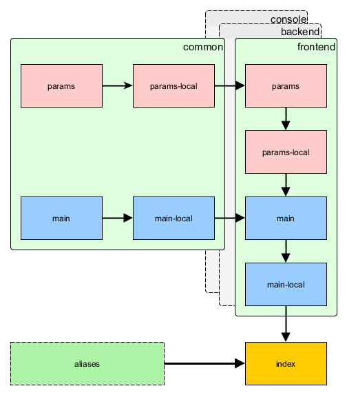

Configuration and environments
==============================

There are multiple problems with a typical approach to configuration:

- Each team member has its own configuration options. Committing such config will affect other team members.
- Production database password and API keys should not end up in the repository.
- There are multiple server environments: development, testing, production. Each should have its own configuration.
- Defining all configuration options for each case is very repetitive and takes too much time to maintain.

In order to solve these issues Yii introduces a simple environments concept. Each environment is represented
by a set of files under the `environments` directory. The `init` command is used to switch between these. What it really does is
copy everything from the environment directory over to the root directory where all applications are.

By default there are two environments: `dev` and `prod`. First is for development. It has all the developer tools
and debug turned on. Second is for server deployments. It has debug and developer tools turned off. 

Typically environment contains application bootstrap files such as `index.php` and config files suffixed with
`-local.php`. These are added to `.gitignore` and never added to source code repository.

In order to avoid duplication configurations are overriding each other. For example, the app reads configuration in the
following order:

- `app/config/main.php`
- `app/config/main-local.php`
- `app/config/web.php`
- `app/config/web-local.php`

Parameters are read in the following order:

- `app/config/params.php`
- `app/config/params-local.php`
- `app/config/params.php`
- `app/config/params-local.php`

The later config file overrides the former.

Here's the full scheme:

